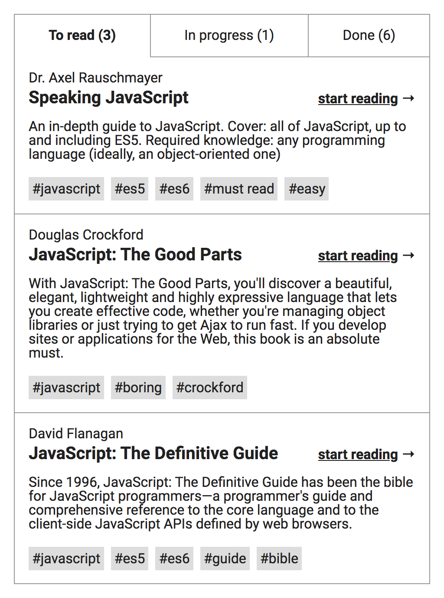
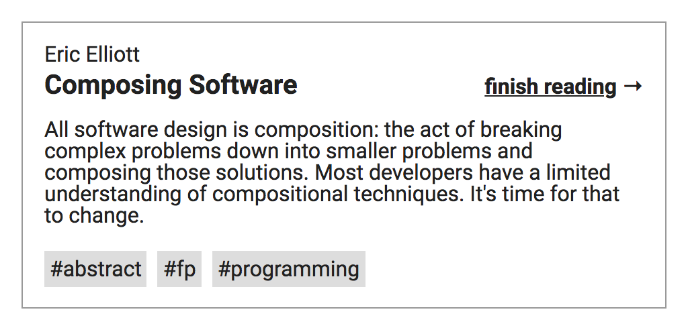
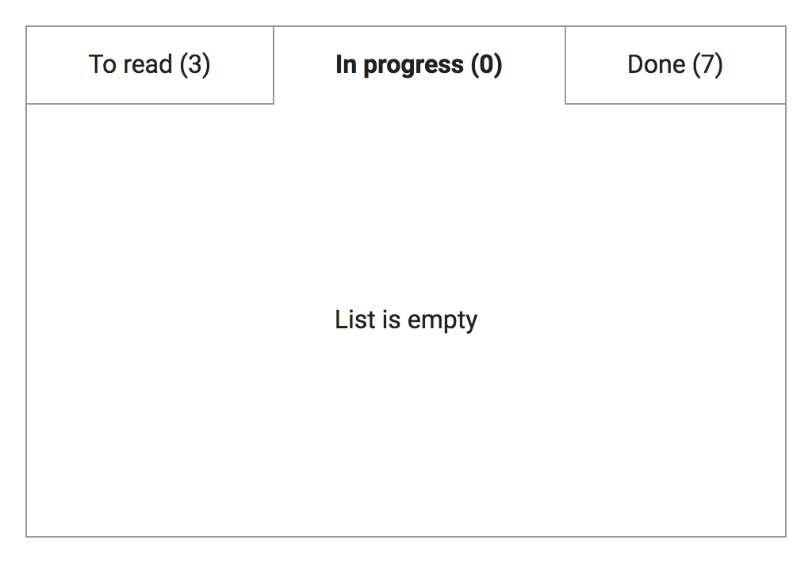
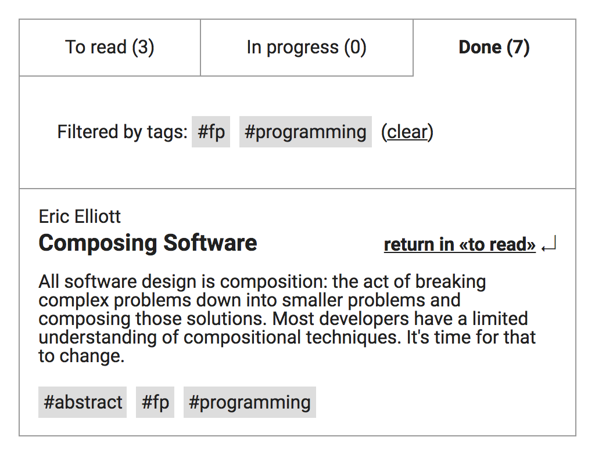

# Тестовое задание для разработчика интерфейсов

Для внутреннего портала нужно сделать виджет списка книг, рекомендованных к чтению.

Есть минималистичный дизайн — он простой, но аккуратный. Шрифт — Roboto, цвета — #000 (текст), #999 (бордеры) и #ddd (фон тегов). Никакой другой информации кроме изображений ниже дизайнер нам не дал.

Книги делятся на три таба: «To read», «In progress», «Done». Изначально все книги в «To read», но пользователь может их перемещать.

Из статуса «To read» книгу можно перевести в «In progress» кнопкой `start reading →`, расположенной справа от названия.

<p align="center">
  
</p>

Из статуса «In progress» можно перевести в «Done» кнопкой `finish reading →`.

<p align="center">
  
</p>

Из статуса «Done» можно перевести в обратно в «To read» кнопкой `return in «to read» ↲`.

<p align="center">
  
</p>

Дизайн пустого списка:

<p align="center">
  
</p>

Клики по тегам включают фильтрацию по ним. Обрати внимание, счётчик в табе показывает количество книг до фильтрации, а не после:

<p align="center">
  
</p>

Книги хранятся в JSON — см. в папку [/data/](/data/). Все поля обязательные.

```json
{
  "items": [
    {
      "id": "uniq id",
      "author": "Author",
      "title": "Title",
      "description": "Description",
      "tags": ["one", "another"]
    }
  ]
}
```

## Требования

- Обязательно используй React.
- Поддерживаемые браузеры — свежий Google Chrome (десктопный и мобильный).
- По ширине виджет должен тянуться от 480px до 1280px (в дизайнах показаны 480px).
- Данные нужно запрашивать. Например, через fetch. Можно прямо [отсюда](https://raw.githubusercontent.com/lastw/test-task/master/data/10-items.json).
- В табах должны быть счётчики, показывающие количество элементов в этом статусе _до фильтрации по тегам_.
- Текущий таб и выбранные фильтры должны попадать в URL и в историю, примеры URL:
  - /
  - /?tab=inprogress
  - /?tab=done
  - /?tags=js,css
  - /?tab=done&tags=js,css
- При переходах по истории должны меняться текущий таб и выбранные фильтры, но не статусы книг.
- Приложение должно открываться в состоянии, указанном в URL — /?tab=done&tags=js откроет таб «Done» с фильтром по тегу «js».
- Между перезагрузками страницы должны сохраняться статусы книг — если перевести книгу в «Done», закрыть страницу и открыть снова, книга всё ещё будет в «Done». Но в URL статусы книг попадать не должны.
- Если есть вопросы по дизайну, и ответа нет в требованиях, принимай решения самостоятельно.
- (\* _задание со звёздочкой, делай только если справился со всем остальным_) Книг может быть очень много. Мы сгенерировали 30000 книг — [30000-items.json](./data/30000-items.json). Хочется, чтобы даже при таком количестве книг приложение не тормозило.

Делать все пункты не обязательно. Бери не количеством, а качеством. Сделай в первую очередь то, что лучше всего знаешь и в чём уверен.

Не делай тестовое круглые сутки, а выдели разумное и комфортное для себя время. Недостающие пункты мы можем обсудить на собеседовании. Напиши нам свои мысли об этих пунктах.
